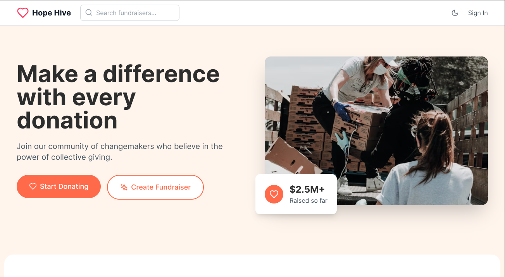

# 🌟 Hope Hive – Fundraiser Website

A modern fundraising platform built with React, TypeScript, Vite, and Firebase. Hope Hive empowers communities to organize fundraisers, track donations, and connect with donors worldwide.  
Features include beautiful UI, real-time donation tracking, secure payments, and social sharing.

---

<p align="center">
  
</p>

---

## 💻 My Favorite Tools & Technologies

<div align="center">
  <table>
    <tr>
      <td align="center" width="96">
        
        <br>React
      </td>
      <td align="center" width="96">
        
        <br>JavaScript
      </td>
      <td align="center" width="96">
        
        <br>TypeScript
      </td>
      <td align="center" width="96">
        
        <br>Git
      </td>
      <td align="center" width="96">
        
        <br>GitHub
      </td>
      <td align="center" width="96">
        
        <br>VS Code
      </td>
      <td align="center" width="96">
        
        <br>Linux
      </td>
    </tr>
  </table>
</div>

---

## 📂 Project Structure

```
.
├── dist/                   # Production build output
├── node_modules/           # Installed dependencies
├── src/                    # Source code
│   ├── App.tsx
│   ├── main.tsx
│   ├── index.css
│   ├── components/
│   ├── lib/
│   ├── store/
│   ├── types/
├── .gitignore
├── index.html
├── package.json
├── package-lock.json
├── postcss.config.js
├── preview.png
├── tailwind.config.js
├── tsconfig.app.json
├── tsconfig.json
├── tsconfig.node.json
├── vite.config.ts
```

---

## ✨ Features

### 👋 Welcome & Home
- Hero section with motivational messaging and stats
- Featured fundraisers and categories

### 🔔 Real-Time Donations
- Track donations and donor stats instantly
- Animated progress bars and charts

### 🌐 Social Sharing
- Share fundraisers via WhatsApp, Facebook, Twitter, and copy link

### 📌 Fundraiser Management
- Create, update, and manage your own fundraisers
- UPI payments with QR code generation

### 🛡️ Privacy & Terms
- Dedicated pages for privacy policy and terms of service

---

## 🚀 How to Run

1. **Install dependencies**
   ```bash
   npm install
   ```
2. **Start the development server**
   ```bash
   npm run dev
   ```
   Open [http://localhost:5173](http://localhost:5173) in your browser.

---

## ⚙️ Customization

- **Categories:** Edit `src/components/CreateFundraiser.tsx` for default categories.
- **Branding:** Replace images in `public/` and update colors in `tailwind.config.js`.
- **Notification & Messages:** Update UI text in relevant components.

---

## 🛠 Tech Stack

- React + TypeScript
- Vite
- Firebase (Firestore, Auth)
- Zustand (state management)
- Tailwind CSS
- Framer Motion (animations)
- Lucide React (icons)

---

## 🤝 Contributing

Contributions are always welcome!

1. Fork the repository
2. Create a feature branch:
   ```bash
   git checkout -b feature/NewFeature
   ```
3. Commit your changes:
   ```bash
   git commit -m 'Add NewFeature'
   ```
4. Push to your branch:
   ```bash
   git push origin feature/NewFeature
   ```
5. Submit a Pull Request

---

## ⭐ Support

If you find this project helpful, please give it a star ⭐ on GitHub.  
It motivates me to keep building and improving!

---

## ⚠️ Backend Maintenance

> **Note:** The backend for this project (Firebase Firestore & Auth) is not actively maintained.  
> For production use, please set up your own Firebase project and update credentials in [`src/lib/firebase.ts`](src/lib/firebase.ts)